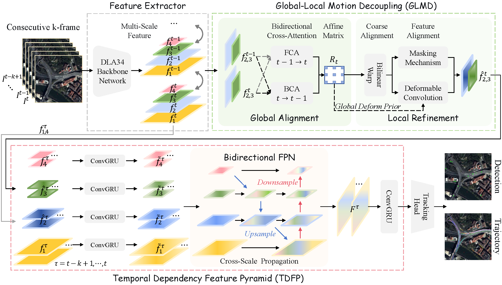
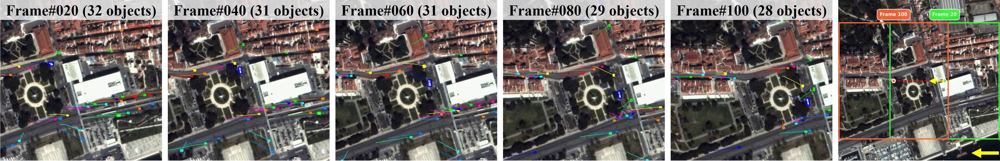
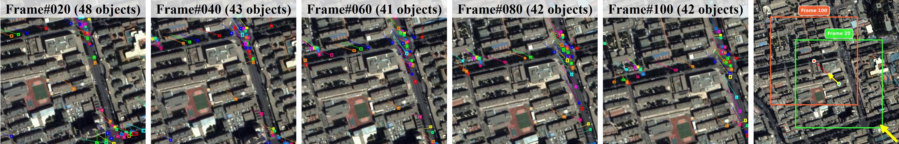
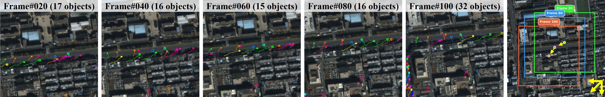

# DeTracker
Official implementation of "DeTracker: Motion-decoupled Vehicle Detection and Tracking in Unstabilized Satellite Videos".

[2026-05-28] Update: We have officially released the *SDM-Car-SU* benchmark dataset, along with the data processing and evaluation scripts. The core network code of DeTracker is currently being refined for our follow-up research and will be open-sourced in the coming months. Stay tuned!

## Highlight


## Brief Introduction
DeTracker addresses motion imbalance in satellite video tracking via a Global–Local Motion Decoupling (GLMD) module, which suppresses background motion and refines target-specific dynamics for stable trajectories. A Temporal Dependency Feature Pyramid (TDFP) further enhances tiny-object representation through cross-frame fusion. We also introduce the *SDM-Car-SU* benchmark for evaluating tracking under diverse motion conditions. DeTracker achieves 61.1% MOTA on *SDM-Car-SU* and 45.3% on real satellite videos.

For more detailed information, please refer to the paper.

## SDM-Car-SU Benchmark

*SDM-Car-SU* is a benchmark for MOT in unstabilized satellite videos. Built upon [SDM-Car](https://github.com/TanedaM/SDM-Car), it simulates realistic on-orbit imaging conditions by introducing global background motion through moving imaging windows. The dataset incorporates diverse motion patterns, including varying directions, speeds, and their combinations, to reflect the complex motion induced by satellite platform dynamics.





### 🗂️ Dataset Download

The released *SDM-Car-SU* dataset contains four subsets: **U1**, **U2**, **U3**, and **Merge**.  
Subsets U1–U3 represent increasing levels of platform motion intensity, while **Merge** is the union of U1, U2, and U3.

To provide stable and flexible access, we offer multiple download mirrors.

| Subset | Description | Hugging Face | Google Drive | Baidu Netdisk |
| :---: | :--- | :---: | :---: | :---: |
| **U1** | 1 pixel/frame displacement | [Download](https://huggingface.co/datasets/AlexChenWhu/SDM-Car-SU/resolve/main/U1.zip?download=true) | [Download](https://drive.google.com/file/d/1EQzYME_lTJHzJpbm7pomoHtu4TYQBvBP/view?usp=sharing) | [Download](https://pan.baidu.com/s/1gCjNC8X6IZdYGeb-hyPBqw?pwd=2026) |
| **U2** | 2 pixels/frame displacement | [Download](https://huggingface.co/datasets/AlexChenWhu/SDM-Car-SU/resolve/main/U2.zip?download=true) | [Download](https://drive.google.com/file/d/1t_223FZR8cTcuPIsGutCTJ8CUEzqJoho/view?usp=sharing) | [Download](https://pan.baidu.com/s/12e7BzOQPgMQafvl8LZyJZQ?pwd=2026) |
| **U3** | 3 pixels/frame displacement | [Download](https://huggingface.co/datasets/AlexChenWhu/SDM-Car-SU/resolve/main/U3.zip?download=true) | [Download](https://drive.google.com/file/d/1LHnR25kgemRmRE15kgkleTKY2gDzn22X/view?usp=sharing)| [Download](https://pan.baidu.com/s/1SC5SwCtu5tu0-bY82YYkgQ?pwd=2026) |
| **Merge** | Union of U1, U2, and U3 | [Download](https://huggingface.co/datasets/AlexChenWhu/SDM-Car-SU/resolve/main/Merge.zip?download=true) | [Download](https://drive.google.com/file/d/15PX6qaUK5IRZADBpUK62oHCEUonQsFM9/view?usp=sharing) | [Download](https://pan.baidu.com/s/1SOeiJ-EZkccrbGT-W8jgsQ?pwd=2026) |

```text
SDM-Car-SU/
├── U1/                         # 1 pixel/frame displacement
│   ├── train_data/
│   │   ├── 1-1-1/
│   │   │   ├── img1/
│   │   │   └── gt.txt
│   │   └── ...
│   ├── test_data/
│   ├── val_data/
│   └── annotations/
│       ├── train.json
│       ├── test.json
│       └── val.json
├── U2/                         # 2 pixels/frame displacement
│   ├── train_data/
│   ├── test_data/
│   ├── val_data/
│   └── annotations/
├── U3/                         # 3 pixels/frame displacement
│   ├── train_data/
│   ├── test_data/
│   ├── val_data/
│   └── annotations/
└── Merge/                      # Union of U1, U2, and U3
    ├── train_data/
    │   ├── 1-1-1-1/            
    │   │   ├── img1/
    │   │   └── gt.txt
    │   ├── 1-1-1-2/            
    │   ├── 1-1-1-3/            
    │   └── ...
    ├── test_data/
    ├── val_data/
    └── annotations/
In the Merge subset, the last suffix of each sequence folder indicates its source subset: -1, -2, and -3 correspond to U1, U2, and U3, respectively.
```

## Overall Performance

Quantitative evaluation on the *SDM-Car-SU* dataset (U1–U3 correspond to increasing platform motion intensities). The best and second-best results are highlighted in **bold** and *italic*, respectively. ↑ indicates higher is better, while ↓ indicates lower is better.

| Method | U1 MOTA↑ | U1 IDF1↑ | U1 IDs↓ | U1 FP↓ | U1 FN↓ | U2 MOTA↑ | U2 IDF1↑ | U2 IDs↓ | U2 FP↓ | U2 FN↓ | U3 MOTA↑ | U3 IDF1↑ | U3 IDs↓ | U3 FP↓ | U3 FN↓ |
| :--- | :--: | :--: | :--: | :--: | :--: | :--: | :--: | :--: | :--: | :--: | :--: | :--: | :--: | :--: | :--: |
| DeepSORT | 39.7% | 55.8% | 1720 | 54105 | 35205 | 42.2% | 62.8% | 2829 | 41045 | 56879 | 14.4% | 39.0% | 6154 | 81293 | 54593 |
| CenterTrack | 40.4% | 62.7% | 3690 | 41906 | 38117 | 37.5% | 61.6% | 3045 | 46028 | 57090 | 25.3% | 53.7% | 5850 | 75863 | 48243 |
| FairMOT | 36.1% | 60.8% | 4013 | 79904 | 49417 | 31.5% | 60.2% | 2942 | 68064 | 54656 | 21.7% | 50.3% | 5484 | 70121 | 53650 |
| CKDNet-SMTNet | 43.5% | 56.7% | 3294 | 54283 | 37757 | 42.8% | 62.6% | *2754* | 44593 | 59550 | 40.3% | 55.1% | *4117* | 39904 | *46773* |
| ByteTrack | 42.7% | 57.6% | 3797 | 56833 | 37251 | 44.6% | 63.9% | 2894 | 39472 | 56620 | 35.7% | 55.6% | 4924 | 50538 | 56375 |
| DSFNet | 46.2% | 63.8% | 3614 | 57304 | 34487 | 42.9% | 62.2% | 2976 | 38911 | 55761 | 32.6% | 54.3% | 5476 | 58711 | 57709 |
| MP2Net | 51.7% | 66.8% | 2105 | 50939 | *33274* | 49.2% | 64.5% | 2925 | 35616 | 56204 | 42.0% | 57.2% | 4214 | 31399 | 55254 |
| DAF | 51.3% | 66.5% | 3230 | 51900 | 34996 | 48.3% | 64.9% | 2853 | 36021 | 56957 | *45.5%* | *61.3%* | 4171 | 38584 | 48751 |
| PIFTracker | *58.8%* | *68.4%* | 2205 | 22949 | 36815 | *53.7%* | *66.5%* | 2760 | 31893 | 58854 | 41.1% | 56.2% | 4206 | *31123* | 47092 |
| MOSAIC-Tracker | 53.1% | 66.5% | 3106 | 38997 | 42687 | 48.0% | 65.9% | 2918 | 43041 | *54338* | 32.7% | 54.1% | 5058 | 53607 | 58506 |
| **DeTracker (Ours)** | **61.1%** | **68.7%** | *1863* | *23065* | **33046** | **55.3%** | **67.2%** | **2657** | *34330* | **51570** | **52.4%** | **63.8%** | **3231** | **14821** | **19775** |

## License
Please note that the *SDM-Car-SU* dataset is made available for academic research purposes only.

[DeTracker: Motion-Decoupled Vehicle Detection and Tracking in Unstabilized Satellite Videos](https://github.com/alex-chenjiajun/DeTracker) © 2026 by Jiajun Chen is licensed under [CC BY-NC 4.0](https://creativecommons.org/licenses/by-nc/4.0/).

<a href="https://creativecommons.org/licenses/by-nc/4.0/">
    
</a>

## Citation
If any parts of our paper and code help your research, please consider citing us and giving a star to our repository.

```bibtex
@ARTICLE{11526742,
  author={Chen, Jiajun and Xiao, Jing and Cao, Shaohan and Zhu, Yuming and Liao, Liang and Pan, Jun and Wang, Mi},
  journal={IEEE Transactions on Geoscience and Remote Sensing}, 
  title={DeTracker: Motion-Decoupled Vehicle Detection and Tracking in Unstabilized Satellite Videos}, 
  year={2026},
  volume={64},
  pages={5623214-5623214},
  doi={10.1109/TGRS.2026.3694908}}
```
```bibtex
@ARTICLE{10746500,
  author={Zhang, Zhen and Peng, Tao and Liao, Liang and Xiao, Jing and Wang, Mi},
  journal={IEEE Geoscience and Remote Sensing Letters}, 
  title={SDM-Car: A Dataset for Small and Dim Moving Vehicles Detection in Satellite Videos}, 
  year={2024},
  volume={21},
  pages={1-5},
  doi={10.1109/LGRS.2024.3493249}}
```
